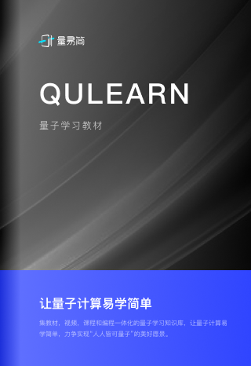

## 量子学习教材

百度研究院量子计算研究所

---

量易简是集教材、视频、课程和编程为一体的量子学习知识库，它提供从理论到实践的全流程指导，大大降低量子计算学习与开发的门槛。

量易简第一章到第四章循序渐进地介绍了量子计算导论、基础量子协议、基础量子算法、进阶量子算法，这部分的内容提供了丰富的基于量易伏平台进行实践的教程。进一步地，第五章则是聚焦适用于近期量子设备的量子算法，展示基于近期量子设备的应用，这部分提供了基于量桨平台进行实践的教程，涵盖量子化学、量子优化、量子机器学习三个前沿方向的典型用例。量子计算离不开具体的硬件计算设备，第六章重点介绍量子计算的物理实现，涵盖超导量子计算中量子比特与量子门的实现方法等核心技术，并提供了基于量脉的量子测控演示。

后续，我们还将在量易简上不断集成百度量子和业界最新研究成果，涵盖量子机器学习、量子模拟、基于测量的量子计算、量子控制、量子噪声处理等多个方向的内容，将其打造成为百度量子平台知识库。量易简就好比量子树根部的土壤，为百度量子平台各项核心功能模块提供源源不断的养分。

在学习与使用本知识库的过程中，欢迎积极反馈建议或者意见至 quantum at baidu.com，这将有助于我们不断地优化迭代量易简。