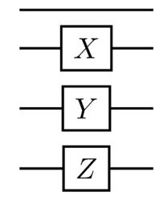
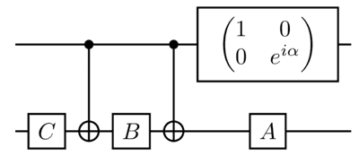

## 量子计算

版权所有 (c) 2021 百度量子计算研究所，保留所有权利。

这一节，我们将介绍量子计算的基本概念：量子比特，量子门，以及量子测量。对量子计算机而言，其输入是量子比特，计算过程是将量子门作用在量子比特上以演化其状态，输出结果是量子测量的测量结果。基于这些基本单元，我们以“**贝尔态**的制备和测量”为例，演示一个简单的量子计算过程。

### 量子比特

#### 从经典到量子

在经典计算机中，我们用二进制的方式来存储数据并进行计算。一个十进制数的每一位可以取 0 到 9 这十个数字中的任意一个，而一个二进制数的每一位只能取 $0$ 或 $1$ 这两个数字。我们熟悉的每一个十进制数都可以被表示为一个二进制数，例如数字 $23$ 对应的二进制数为 $10111$，即

$$
23=1×2^4+0×2^3+1×2^2+1×2^1+1×2^0=(10111)_2,
$$

这里 $(10111)_2$ 的下标 $2$ 表示 $10111$ 是一个二进制数。一个二进制数中的一位我们称其为比特（Bit），它可以是 $0$ 或 $1$，我们说二进制数 $10111$ 由五个比特表示。

在量子计算机中，我们仍然保留了二进制的思想，但比特变成了量子比特（Quantum Bit, Qubit），$0$ 和 $1$ 也变成了 $|0\rangle$ 和 $|1\rangle$。与数字 $0$ 和 $1$ 不同，这里的 $|0\rangle$ 和 $|1\rangle$ 是两个向量，

$$
\left.|0\rangle=\left[\begin{array}{c}1\\0\end{array}\right.\right],\quad|1\rangle=\left[\begin{array}{c}0\\1\end{array}\right],
$$

表示该量子比特所处的量子态（Quantum State），有时也被称为态向量（State Vector）。

#### 单量子比特

向量可以更好地体现出量子态**叠加**这一特性。给定一个量子比特，在我们测量（量子测量会在后面介绍）它之前，它处于 $|0\rangle$ 和 $|1\rangle$ 的某种叠加态上。数学上，我们说这个量子比特所处的量子态 $|\psi\rangle$ 是 $|0\rangle$ 和 $|1\rangle$ 的一个线性组合，即

$$
\left.|\psi\rangle=\alpha|0\rangle+\beta|1\rangle=\left[\begin{array}{c}\alpha\\\beta\end{array}\right.\right],
$$

其中 $\alpha,\beta\in\mathbb{C}$（复数）满足 $\left|\alpha\right|^2+\left|\beta\right|^2=1$，分别被称为量子态 $|\psi\rangle$ 在 $|0\rangle$ 和 $|1\rangle$ 方向上的**概率幅**（Probability Amplitude）。

考虑到

$$
|\psi\rangle=I_2|\psi\rangle=(|0\rangle\langle0|+|1\rangle\langle1|)|\psi\rangle=|0\rangle\langle0|\psi\rangle+|1\rangle\langle1|\psi\rangle,
$$

有 $\alpha=\langle0|\psi\rangle$，$\beta=\langle1|\psi\rangle$。约束 $\left|\alpha\right|^2+\left|\beta\right|^2=1$ 保证了态向量 $|\psi\rangle$ 是一个单位向量，即

$$
\langle\psi|\psi\rangle=\left|\alpha\right|^2+\left|\beta\right|^2=1.
$$

我们称 $(5)$ 为**归一化条件**（Normalization Condition）。相信读者在学习了关于量子测量的内容后，便能理解归一化的重要性。

由归一化条件，我们可以将 $|\psi\rangle$ 写成

$$
|\psi\rangle=e^{i\lambda}\left(\cos\frac\theta2|0\rangle+e^{i\varphi}\sin\frac\theta2|1\rangle\right),
$$

其中 $\lambda,\theta,\varphi$ 均为实数。在后续量子测量小节时我们会证明，被称为**全局相位**（Global Phase）的 $e^{i\lambda}$ 项不会对量子态产生任何物理上可分辨的影响，所以我们可以忽略全局相位，将上式重写成

$$
|\psi\rangle=\cos\frac\theta2|0\rangle+e^{i\varphi}\sin\frac\theta2|1\rangle.
$$

这种基于 $\theta,\varphi$ 的表示，构建了单比特量子（纯）态与三维球面上的点的一一对应关系（如下图1所示）。此球坐标表示方法被称为**布洛赫球面表示法**（Bloch Sphere Representation）。

布洛赫球面表示是一种对单量子比特态向量的几何表示法，可以直观地展现单量子比特的许多特性。当 $\theta=0$ 和 $\theta=\pi$ 时，$|\psi\rangle$ 就是我们熟悉的 $|0\rangle$ 和 $|1\rangle$，所以球面的北极和南极分别对应单个量子比特的 $|0\rangle$ 态和 $|1\rangle$ 态。

可以观察到，量子态 $|\psi\rangle$ 在布洛赫球上的对径点（关于球心的对称点）恰为

$$
|\psi^\perp\rangle=\cos\frac{\pi-\theta}2|0\rangle+e^{i(\varphi+\pi)}\sin\frac{\pi-\theta}2|1\rangle=\sin\frac\theta2|0\rangle-e^{i\varphi}\cos\frac\theta2|1\rangle,
$$

其满足

$$
\langle\psi^\perp|\psi\rangle=\sin\frac\theta2\mathrm{cos}\frac\theta2-e^{-i\varphi}e^{i\varphi}\cos\frac\theta2\mathrm{sin}\frac\theta2=0,
$$

进而 $\{|\psi\rangle,|\psi^\perp\rangle\}$ 为二维希尔伯特空间的一组标准正交基。

在量子计算中，我们称 $\{|0\rangle,|1\rangle\}$ 为计算基（Computational Basis），因为运算通常都是在这个基下进行的。而当我们在 $\{|\psi\rangle,|\psi^\perp\rangle\}$ 基下进行运算时，$|0\rangle,|1\rangle$ 可以写成 $\{|\psi\rangle,|\psi^\perp\rangle\}$ 的线性组合。

> **习题 1.** 将 $|0\rangle,|1\rangle$ 写成 $\{|\psi\rangle,|\psi^\perp\rangle\}$ 的线性组合。

#### 多量子比特

在经典计算机中，一个比特只能表示 $0$ 或 $1$，而要完成现在的许多任务，需要成千上万的比特参与运算。同样地，要造出实用的量子计算机，单个量子比特是远远不够的。在一个量子比特的情况下，我们类比一个经典比特的两种状态 $0,1$ 构造出了单个量子比特的计算基 $\{|0\rangle,|1\rangle\}$。如果有两个经典比特，那它们的状态有 $00,01,10,11$ 四种情况。类似地，在两个量子比特的情况下，我们可以构造出它们的计算基为

$$
\left.\left\{|00\rangle=\begin{bmatrix}1\\0\\0\\0\end{bmatrix}\right.,|01\rangle=\begin{bmatrix}0\\1\\0\\0\end{bmatrix},|10\rangle=\begin{bmatrix}0\\0\\1\\0\end{bmatrix},|11\rangle=\begin{bmatrix}0\\0\\0\\1\end{bmatrix}\right\}.
$$

具体来说，对于一个两量子比特系统的态 $|\psi\rangle$，它可以表示为

$$
|\psi\rangle=\alpha_{00}|00\rangle+\alpha_{01}|01\rangle+\alpha_{10}|10\rangle+\alpha_{11}|11\rangle=\begin{bmatrix}\alpha_{00}\\\alpha_{01}\\\alpha_{10}\\\alpha_{11}\end{bmatrix},
$$

其中 $\alpha_{00},\alpha_{01},\alpha_{10},\alpha_{11}\in\mathbb{C}$ 且 $\left|\alpha_{00}\right|^2+\left|\alpha_{01}\right|^2+\left|\alpha_{10}\right|^2+\left|\alpha_{11}\right|^2=1$。

细心的读者可能会想，与经典比特的状态类似，当两个量子比特处于 $|00\rangle$ 态时，是否表示它们两个都各自处于 $|0\rangle$ 的状态呢？答案是肯定的。事实上，$|00\rangle$ 是一种缩写，更确切的表达是

$$
|0\rangle\otimes|0\rangle,
$$

更进一步地说，两个量子比特的态所处的希尔伯特空间其实就是单个量子比特的希尔伯特空间的张量积

$$
H_{AB}=H_A\otimes H_B.
$$

假设我们有两个量子比特，如果每个量子比特的状态由各自的态向量描述，那么这两个量子比特构成的系统的量子态就是这些态向量的张量积。反之，是否两量子比特系统所有的状态都可以写成两个单量子比特态向量的张量积呢？答案是否定的。例如贝尔态就是一类重要的两量子比特态，但它们无法分解成两个单量子比特态向量的张量积。在计算基下某个贝尔态可以表示为

$$
\frac1{\sqrt{2}}(|00\rangle+|11\rangle).
$$

> **引理 1.** 公式 $(14)$ 定义的贝尔态不可以写成两个单量子比特态向量的张量积。

**证明.** 以下我们用反证法说明该贝尔态不能被分解成两个量子比特态向量的张量积。

假设贝尔态可以写成两个单量子比特态向量的张量积，即存在 $\alpha_{0},\beta_{0},\alpha_{1},\beta_{1}$ 使得

$$
\begin{aligned}
\begin{aligned}\frac{1}{\sqrt{2}}(|00\rangle+|11\rangle)\end{aligned}& =(\alpha_0|0\rangle+\beta_0|1\rangle)\otimes(\alpha_1|0\rangle+\beta_1|1\rangle)  \\
&=\alpha_0\alpha_1|00\rangle+\alpha_0\beta_1|01\rangle+\beta_0\alpha_1|10\rangle+\beta_0\beta_1|11\rangle.
\end{aligned}
$$

通过比较等式左右两边，我们可以发现等式 $(15)$ 成立当且仅当 $\alpha_0\alpha_1=\beta_0\beta_1=1/\sqrt{2}$，且 $\alpha_0\beta_1=\beta_0\alpha_1=0$。由此，我们有

$$
\alpha_0\alpha_1)(\beta_0\beta_1)=\frac12,
$$

$$
(\alpha_0\beta_1)(\beta_0\alpha_1)=0.
$$

但是，$(\alpha_0\alpha_1)(\beta_0\beta_1)=\alpha_0\alpha_1\beta_0\beta_1=\alpha_0\beta_1\beta_0\alpha_1=(\alpha_0\beta_1)(\beta_0\alpha_1)$，与式 $(16)$，$(17)$ 相矛盾。因此，不存在一组 $\alpha_{0},\alpha_{1},\beta_{0},\beta_{1}$ 使得等式 $(15)$ 成立。 也就是说，公式 $(14)$ 定义的贝尔态不可以写成两个单量子比特态向量的张量积。

像贝尔态这样不能分解成两个单量子比特态向量的张量积的态，我们称之为**纠缠态**（Entangled State）。也就是说，当一个两量子比特系统处于贝尔态时，我们无法用态向量去准确地描述其中某个量子比特的状态，此时就要引入**密度算符**（Density Operator）或**密度矩阵**（Density Matrix）的概念。密度算符，与态向量相似，也是用来描述一个物理系统的状态的，在本章第四节中将作详细介绍。

最一般的情况下，我们需要考虑一个拥有 $n$ 个量子比特的量子系统。此时，该量子系统的计算基集合为

$$
\left\{\left|x_0x_1\cdots x_{n-1}\right\rangle\mid x_0,x_1,\cdots,x_{n-1}\in\left\{0,1\right\}\right\},
$$

其中 $|x_i\rangle$ 表示第 $i$ 个量子比特的状态（注意，此处约定量子比特从 $0$ 开始编号）。该集合的元素个数为 $2^n$，因此拥有 $n$ 个量子比特的量子态 $|\psi\rangle$ 由 $2^n$ 个概率幅决定。当 $n=500$ 时，$2500$ 比整个宇宙的原子个数还要多，因此想要在经典计算机上表示出拥有 $500$ 个量子比特的一般量子态 $|\psi\rangle$ 是不可能完成的任务。然而，在量子计算机上，理论上该量子态只需要 $500$ 个二能级量子系统就可以描述，因此量子计算机理论上蕴含着无与伦比的计算能力。

### 单量子比特门

在了解量子比特和多量子比特系统之后，我们下面介绍操作量子比特的方法。相较于经典计算中的逻辑门，在量子计算中，**量子门**（Quantum Gate）是对量子态的操作。为了让读者更好地理解量子门的概念，我们在这里先介绍作用在单量子比特上的量子门，称为单量子比特门。比较重要的单量子比特门有泡利门（$I$、$X$、$Y$、$Z$）、旋转门（$R_x$、$R_y$、$R_z$）、Hadamard 门（$H$）、相位门（$S$）、以及 $\pi/8$ 门（$T$），其中括号内的符号是相应量子门的数学符号。以下我们详细介绍这些量子门的矩阵形式以及它们在量子电路中的表达方式。

这里量子门可以简单理解为状态演化的演化矩阵，其作用在量子比特上就是计算矩阵与态向量的乘积，结果就是演化后的态向量。也就是说，量子门可以看做是在态空间（希尔伯特空间）上的一些线性变换。因为量子门要把任意单位向量（因为是态向量）映射为单位向量，所以量子门一定是酉变换（其矩阵形式是酉矩阵）；特别地，单比特量子门的矩阵形式都是二维酉矩阵。

**泡利门。** 泡利门包括 $I$、$X$、$Y$、$Z$ 门，它们的矩阵形式如下：

$$
I:=|0\rangle\langle0|+|1\rangle\langle1|=\begin{bmatrix}1&0\\0&1\end{bmatrix};
$$

$$
X:=|0\rangle\langle1|+|1\rangle\langle0|=\begin{bmatrix}0&1\\1&0\end{bmatrix};
$$

$$
Y:=-i|0\rangle\langle1|+i|1\rangle\langle0|=\begin{bmatrix}0&-i\\i&0\end{bmatrix};
$$

$$
Z:=|0\rangle\langle0|-|1\rangle\langle1|=\begin{bmatrix}1&0\\0&-1\end{bmatrix}.
$$

在量子电路图中，泡利门的符号依次是（考虑到 $I$ 门不会改变量子比特的状态，这里我们用一条直线来表示泡利 I 门）：

下面，我们通过一些例子来了解泡利门的效果。

当把 $X$ 作用在计算基态上时，就是将其矩阵形式乘在基态对应的态向量上，通过矩阵运算可得

$$
X|0\rangle=\begin{bmatrix}0&1\\1&0\end{bmatrix}\begin{bmatrix}1\\0\end{bmatrix}=\begin{bmatrix}0\\1\end{bmatrix}=|1\rangle,
$$

$$
X|1\rangle=\begin{bmatrix}0&1\\1&0\end{bmatrix}\begin{bmatrix}0\\1\end{bmatrix}=\begin{bmatrix}1\\0\end{bmatrix}=|0\rangle.
$$

直观上，泡利 $X$ 门翻转量子比特的状态：当它的状态是 $|0\rangle$ 时，作用 $X$ 之后它的状态变成 $|1\rangle$；当它的状态是 $|1\rangle$ 时，作用 $X$ 之后它的状态变成 $|0\rangle$。正因如此，$X$ 门也被称作量子比特翻转门。类似的，我们有

$$
Y|0\rangle=\begin{bmatrix}0&-i\\i&0\end{bmatrix}\begin{bmatrix}1\\0\end{bmatrix}=\begin{bmatrix}0\\i\end{bmatrix}=i|1\rangle,
$$

$$
\left.Y|1\rangle=\left[\begin{array}{cc}0&-i\\i&0\end{array}\right.\right]\begin{bmatrix}0\\1\end{bmatrix}=\begin{bmatrix}-i\\0\end{bmatrix}=-i|0\rangle;
$$

$$
Z|0\rangle=\begin{bmatrix}1&0\\0&-1\end{bmatrix}\begin{bmatrix}1\\0\end{bmatrix}=\begin{bmatrix}1\\0\end{bmatrix}=|0\rangle,
$$

$$
\left.Z|1\rangle=\left[\begin{array}{cc}1&0\\0&-1\end{array}\right.\right]\left[\begin{array}{c}0\\1\end{array}\right]=\left[\begin{array}{c}0\\-1\end{array}\right]=-|1\rangle.
$$

> **习题 2.** 证明 $XYX=−Y$，$YZY=−Z$，$ZXZ=−X$。

**Hadamard 门。** Hadamard 门 $H$ 的矩阵形式如下：

$$
\left.H=\dfrac{1}{\sqrt{2}}\left[\begin{array}{cc}1&1\\1&-1\end{array}\right.\right].
$$

在量子电路图中，它的符号是：

当把 $H$ 作用在计算基态上时，通过矩阵运算可得

$$
H|0\rangle=\frac1{\sqrt2}\begin{bmatrix}1&1\\1&-1\end{bmatrix}\begin{bmatrix}1\\0\end{bmatrix}=\frac1{\sqrt2}\begin{bmatrix}1\\1\end{bmatrix}=:|+\rangle,
$$

$$
H|1\rangle=\dfrac{1}{\sqrt{2}}\begin{bmatrix}1&1\\1&-1\end{bmatrix}\begin{bmatrix}0\\1\end{bmatrix}=\dfrac{1}{\sqrt{2}}\begin{bmatrix}1\\-1\end{bmatrix}=:|-\rangle.
$$

**相位门。** 相位门（Phase Gate）$S$ 的矩阵形式如下：

$$
\left.S=\left[\begin{array}{cc}1&0\\0&i\end{array}\right.\right].
$$

在量子电路图中，它的符号是：

**$\pi/8$ 门。** $\pi/8$ 门 $T$ 的矩阵形式如下：

$$
T=\begin{bmatrix}1&0\\0&e^{i\pi/4}\end{bmatrix}.
$$

在量子电路图中，它的符号是：

> **习题 3.** 证明 $H=(X+Z)/\sqrt2$ 和 $S=T^2$。

> **习题 4.** 证明 $HXH=Z$，$HYH=−Y$ 和 $HZH=X$。

**旋转门。** 由布洛赫球面表示可以看到，单比特量子（纯）态的演化相当于在球面投影的变化，对应的演化过程总可以表示为绕一固定轴旋转某一角度的旋转操作。例如泡利 $X$ 门就相当于绕布洛赫球的 $x$ 轴旋转 $\pi$ 角度的量子门。

下面我们介绍更一般的，操控量子态围绕布洛赫球的 $x$、$y$、$z$ 轴旋转的量子门。我们用 $R_x(\theta)$ 表示围绕布洛赫球的 $x$ 轴旋转 $\theta$ （弧度制）的量子门，$R_y(\theta)$ 表示围绕布洛赫球的 $y$ 轴旋转 $\theta$ 的量子门，而 $R_z(\theta)$ 表示围绕布洛赫球的 $z$ 轴旋转 $\theta$ 的量子门。这些量子门的矩阵形式如下：

$$
\left.R_x(\theta):=e^{-i\theta X/2}=\cos\frac\theta2I-i\sin\frac\theta2X=\left[\begin{array}{rr}\cos\frac\theta2&-i\sin\frac\theta2\\-i\sin\frac\theta2&\cos\frac\theta2\end{array}\right.\right];
$$

$$
\left.R_y(\theta):=e^{-i\theta Y/2}=\cos\frac{\theta}{2}I-i\sin\frac{\theta}{2}Y=\left[\begin{array}{rr}\cos\frac{\theta}{2}&-\sin\frac{\theta}{2}\\\\\sin\frac{\theta}{2}&\cos\frac{\theta}{2}\end{array}\right.\right];
$$

$$
R_z(\theta):=e^{-i\theta Z/2}=\cos\frac\theta2I-i\sin\frac\theta2Z=\begin{bmatrix}e^{-i\theta/2}&0\\0&e^{i\theta/2}\end{bmatrix}.
$$

在量子电路中，它们的符号依次如下：

> **习题 5.** 证明旋转门定义中的等式 $(34)$，$(35)$ 和 $(36)$。

> **习题 6.** 假设 $\theta$ 是实数，$A$ 是一个满足 $A^2=I$ 的方阵，这里 $I$ 是与 $A$ 规模相同的单位矩阵，证明
> 
> $$
> \exp(i\theta A)=\cos(\theta)I+i\sin(\theta)A.
> $$

前面我们介绍了围绕布洛赫球的 $x$、$y$、$z$ 轴的旋转门。类似地，我们可以构造围绕布洛赫球面上任意向量的旋转门。简记 $\vec{\sigma}=(X,Y,Z)$ 是由三个泡利门构成的向量。给定实三维单位向量 $\vec{n}=(n_x,n_y,n_z)$，那么在布洛赫球上围绕 $\vec{n}$ 向量旋转角度 $\theta$ 的量子门的构造方式如下：

$$
R_{\vec{n}}(\theta):=e^{-i\theta\vec{n}\cdot\vec{\sigma}/2}=\cos(\theta/2)I-i\sin(\theta/2)\vec{n}\cdot\vec{\sigma}.
$$

其中 $\vec{n}\cdot\vec{\sigma}:=n_xX+n_yY+n_zZ$。

> **习题 7.** 证明 $(\vec{n}\cdot\vec{\sigma})^2=I$，并且用这个结论来证明上式 $(38)$。

> **习题 8.** 证明 $XR_y(\theta)X=R_y(−\theta)$，$XR_z(\theta)X=R_z(−\theta)$。

最后，我们通过两个重要的结论来结束单量子比特门这一小段。特别地，第一个结论说明了任意单量子比特门都可以通过旋转门来构造；第二个结论是构造更复杂的多量子比特量子控制门（下一段介绍）的基础。

> **定理 2（Z−Y分解）.** 假设 U 是任意单量子比特门，那么 U 可以分解为如下形式：
> 
> $$
> U=e^{i\alpha}R_z(\beta)R_y(\gamma)R_z(\delta),
> $$
> 
> 其中 $\alpha$、$\beta$、$\gamma$ 和 $\delta$ 是实数。

**证明.** 由于 $U$ 是二维酉矩阵，那么它的行向量和列向量都是单位正交的。因此，$U$ 可以表示为

$$
\left.U=\left[\begin{array}{cc}e^{i(\alpha-\beta/2-\delta/2)}\cos(\gamma/2)&-e^{i(\alpha-\beta/2+\delta/2)}\sin(\gamma/2)\\e^{i(\alpha+\beta/2-\delta/2)}\sin(\gamma/2)&e^{i(\alpha+\beta/2+\delta/2)}\cos(\gamma/2)\end{array}\right.\right].
$$

其中 $\alpha$ 表示全局相位，$\beta$ 和 $\delta$ 分别表示列间和行间相对相位。 

上述定理说明了单量子比特上的任意量子门都可以由旋转门构造。

> **推论 3.** 假设 $U$ 是任意单量子比特门，那么存在量子门 $A$、$B$、$C$ 使得 $ABC=I$ 和 $U=e^{i\alpha}AXBXC$，其中 $\alpha$ 是全局相位。

**证明.** 定义实数 $\alpha$、$\beta$、$\gamma$ 和 $\delta$，并如**定理 2**，定义量子门 $A$、$B$、$C$ 如下所示：

$$
A:=R_z(\beta)R_y(\gamma/2);
$$

$$
B:=R_y(-\gamma/2)R_z(-(\delta+\beta)/2);
$$

$$
C:=R_z((\delta-\beta)/2).
$$

特别地，从定义我们可知：

$$
ABC=R_z(\beta)R_y(\gamma/2)R_y(-\gamma/2)R_z(-(\delta+\beta)/2)R_z((\delta-\beta)/2)=I.
$$

同时，我们利用事实 $X^2=I$ 和前面**习题 8** 的结论，可以发现

$$
XBX=XR_y(-\gamma/2)XXR_z(-(\delta+\beta)/2)X=R_y(\gamma/2)R_z((\delta+\beta)/2).
$$

利用上述结果，我们得到下式

$$
\begin{aligned}
AXBXC& =R_z(\beta)R_y(\gamma/2)R_y(\gamma/2)R_z((\delta+\beta)/2)R_z((\delta-\beta)/2)  \\
&=R_z(\beta)R_y(\gamma)R_z(\delta).
\end{aligned}
$$

综合上述讨论，我们可以得到结论 $U=e^{i\alpha}AXBXC$ 和 $ABC=I$。 

在下面介绍多量子比特门时，我们会讲到一类常用的门：量子控制门，而一种构造量子控制门的方法就是基于上述**推论 3** 。

> **习题 9.** 证明单量子比特上的量子门也有 X−Y 分解，也就是说，我们可以用 Rx 和 Ry 来表示任意的单量子比特门。

### 多量子比特门

上一段介绍了单量子比特门，现在我们介绍作用在多个量子比特上的量子门：多量子比特门。

针对多量子比特系统，有一类量子门是可以直接通过单量子比特门构造的，比如 $H\otimes X$，即对前一个量子比特作用单比特量子门 $H$ 的同时，对后一个作用单比特量子门 $X$。假设有量子态 $|01\rangle$，当它经过 $H\otimes X$ 后，量子态演变为 $(H\otimes X)\cdot|01\rangle=(H|0\rangle)\otimes(X|1\rangle)=|+\rangle\otimes|0\rangle$。可以看出，量子门只独立地改变了每个量子比特的状态，并没有使量子比特之间产生纠缠。更准确地说，应该是没有改变两个量子比特间纠缠的强度。这一过程的量子电路如下图 7 所示：

其中左边一列表示输入时量子比特系统的状态，右边一列表示输出时量子比特系统的状态，不同行之间用张量积来联系，更上方的行在计算张量积是在左边。故而输入的量子态是 $|0\rangle\otimes|1\rangle$，输出的量子态是 $|+\rangle\otimes|0\rangle$，操作的量子门是 $H\otimes X$。

然而，很多重要的量子门，比如**量子控制门**（Quantum Controlled Gate），则会使得一些量子比特的演化受到其余的量子比特的影响，从而产生纠缠态。特别地，控制门是设计量子算法的基本工具，是量子计算中非常重要的一类门。因此，在这一段，我们重点来介绍多量子比特系统上的控制门。

首先，我们来了解一些两量子比特系统上的控制门。

**$\mathrm{CNOT}$ 门。** 在两量子比特门中，最典型的就是 $\mathrm{CNOT}$ 门（Controlled-NOT）。在两个量子比特上作用 $\mathrm{CNOT}$ 门时，$\mathrm{CNOT}$ 将其中一个作为控制量子比特，另一个作为目标量子比特。在通过 $\mathrm{CNOT}$ 门后，控制量子比特的状态不变，而目标量子比特的状态会受到控制量子比特状态的影响。具体地，我们用 $|c\rangle$ 表示控制量子比特的状态，$|t\rangle$ 表示目标量子比特的状态，那么 $\mathrm{CNOT}$ 在计算基上的作用可以表示为

$$
|c\rangle|t\rangle\to|c\rangle|c\oplus t\rangle,
$$

其中量子态中的 $\oplus$ 表示模 $2$ 加法运算。我们可以通过分析 $\mathrm{CNOT}$ 在计算基上的作用来体验 $\mathrm{CNOT}$ 的效果：

$$
|0\rangle|0\rangle\to|0\rangle|0\oplus0\rangle=|0\rangle|0\rangle,
$$

$$
|0\rangle|1\rangle\to|0\rangle|0\oplus1\rangle=|0\rangle|1\rangle,
$$

$$
|1\rangle|0\rangle\to|1\rangle|1\oplus0\rangle=|1\rangle|1\rangle,
$$

$$
|1\rangle|1\rangle\to|1\rangle|1\oplus1\rangle=|1\rangle|0\rangle,
$$

可以发现，当控制量子比特是 $|0\rangle$ 的时候，目标量子比特的状态不变；然而当控制量子比特的状态是 $|1\rangle$ 的时候，目标量子比特会被作用泡利 $X$ 门，因此 $\mathrm{CNOT}$ 门也被称为 $\mathrm{CX}$ 门。

值得一提的是，$\mathrm{CNOT}$ 门在量子计算中具有极高的重要性，在**量子计算浅尝**小节我们将看到，如何用 $\text{CNOT}$ 门制备贝尔态。

在计算基下 $\mathrm{CNOT}$ 门的矩阵形式为

$$
\mathrm{CNOT}:=|0\rangle\langle0|\otimes I+|1\rangle\langle1|\otimes X=\begin{bmatrix}1&0&0&0\\0&1&0&0\\0&0&0&1\\0&0&1&0\end{bmatrix}.
$$

需要注意，该矩阵是将第一个量子比特作为控制量子比特、第二个量子比特为目标量子比特的情况。因此如上形式的 $\mathrm{CNOT}$ 量子门也被写作 $\mathrm{CNOT}_{0\to1}$，表示这个 $\mathrm{CNOT}$ 量子门作用的两个量子比特中，第一个量子比特是控制量子比特，而第二个量子比特是目标量子比特。如果是第一个量子比特为目标量子比特而第二个为控制量子比特的情况，那么此时 $\mathrm{CNOT}$ 的矩阵形式为：

$$
\mathrm{CNOT}_{1\to0}:=I\otimes|0\rangle\langle0|+X\otimes|1\rangle\langle1|=\begin{bmatrix}1&0&0&0\\0&0&0&1\\0&0&1&0\\0&1&0&0\end{bmatrix}.
$$

在量子电路图中，$\mathrm{CNOT}_{0\to1}$ 的符号如下所示：

图 8 中实心点所在的线表示控制量子比特，而 $\oplus$ 所在的线表示目标量子比特。类似地，$\mathrm{CNOT}_{0\to1}$ 门也可以用下图 9 中的符号表示：

值得一提的是，一个量子门由其作用在各计算基后得到态向量及全局相位变化唯一决定，如泡利 $Z$ 门虽不改变计算基态 $|1\rangle$，但会引起一个全局相位变化 $|1\rangle\to−|1\rangle$，这个全局相位变化的不同将能区分 $Z$、$S$ 以及 $T$ 门等等。所以能实现变换 $(48−51)$ 的量子门不止有 $\mathrm{CNOT}$，比如 $(Z\otimes I)\cdot\mathrm{CNOT}$。

**两量子比特控制门。** 由上面的分析可知，作用 $\mathrm{CNOT}$ 门时，控制量子比特的状态决定了是否将 $X$ 量子门作用在目标量子比特上。同理，$\mathrm{CNOT}$ 中的 $X$ 门可以换成更一般的单量子比特门 $U$。我们称这样的操作为量子控制门，记为 $c−U$ 门（Controlled-U gate），其效果是，当控制量子比特为 $|1\rangle$ 的时候，将单量子比特门 $U$ 作用在目标量子比特上，否则不操作。另外，除了 $c−U$ 外，量子控制门还有其它符号表示，比如 $C(U)$ 或者 $C−U$ 等，读者可以从上下文语境中判断出它们表示的是量子控制门。$c−U$ 门的作用可以表示为

$$
|c\rangle|t\rangle\to|c\rangle U^c|t\rangle.
$$

相应地，其矩阵形式为

$$
C(U):=|0\rangle\langle0|\otimes I+|1\rangle\langle1|\otimes U=\begin{bmatrix}I&0\\0&U\end{bmatrix}.
$$

在量子电路图中，量子控制门的符号如下所示：

同样地，图 10 中实心点所在的线表示控制量子比特，而 $U$ 所在的线表示目标量子比特。不同的是，单量子比特门由 $\mathrm{CNOT}$ 中的 $X$ 变为了任意的单量子比特门 $U$。

下面，我们通过几个习题来加深对控制门的理解。

> **习题 10.** 写出控制 $Y$、$Z$ 门（即 $c−Y$ 和 $c−Z$）的矩阵形式。

> **习题 11.** 证明下面两个电路图是等价的。
>
> 

> **习题 12.** 使用单量子比特门和 $\mathrm{CNOT}$ 构造控制门 $c−U$，其中取 $U=R_x(\theta)$ 和 $U=R_y(\theta)$。

现在，我们来介绍如何构造两量子比特上的控制门。回忆在**推论 3** 中，我们介绍了单量子比特门 $U$ 的分解，即任何单量子比特门 $U$ 都可以分解为 $U=e^{i\alpha}AXBXC$，其中 $ABC=I$。实际上，两量子比特上的控制门 $c−U$ 的构造方法和这个分解紧密相关。

下图 12 展示了一个量子电路，我们来看一下量子比特 |00⟩ 和 |10⟩ 通过这个电路的演化过程。

这里我们先不去追究量子电路的计算方式，先数学地给出 $C(U)$ 的一个分解：

$$
\begin{aligned}
&\left.\left(\begin{bmatrix}1&0\\0&e^{i\alpha}\end{bmatrix}\right.\otimes A\right)\cdot C(X)\cdot(I\otimes B)\cdot C(X)\cdot(I\otimes C) \\
&= \left.\left(\begin{bmatrix}1&0\\0&e^{i\alpha}\end{bmatrix}\right.\otimes A\right)\cdot(|0\rangle\langle0|\otimes I+|1\rangle\langle1|\otimes X)\cdot(I\otimes B)\cdot(|0\rangle\langle0|\otimes I+|1\rangle\langle1|\otimes X)\cdot(I\otimes C)  \\
&= |0\rangle\langle0|\otimes ABC+|1\rangle\langle1|\otimes e^{i\alpha}AXBXC  \\
&= C(U). 
\end{aligned}
$$

从上面两个式子可以看出，图 12 中的电路在 $|00\rangle$ 和 $|10\rangle$ 上的作用效果和控制门 $c−U$ 的效果一样。实际上它们是等价的，这一点可以通过对比它们在计算基上的作用效果来得到，我们将剩下的部分留给读者来补充，以便加深对控制门的理解。

**$\mathrm{SWAP}$ 门。** $\mathrm{SWAP}$ 门是一个两量子比特门，它的作用是交换两个量子比特的状态。用 $|x\rangle$ 表示第一个量子比特的状态，$|y\rangle$ 表示第二个量子比特的状态，那么 $\mathrm{SWAP}$ 的作用可以表示为

$$
|x\rangle|y\rangle\to|y\rangle|x\rangle
$$

我们可以通过分析 $\mathrm{SWAP}$ 在计算基上的作用来体验 $\mathrm{SWAP}$ 的效果：

$$
|0\rangle|0\rangle\to|0\rangle|0\rangle
$$

$$
|0\rangle|1\rangle\to|1\rangle|0\rangle
$$

$$
|1\rangle|0\rangle\to|0\rangle|1\rangle
$$

$$
|1\rangle|1\rangle\to|1\rangle|1\rangle
$$

从上面的式子可以推算出 $\mathrm{SWAP}$ 在计算基下的矩阵形式为

$$
\mathrm{SWAP}:=\begin{bmatrix}1&0&0&0\\0&0&1&0\\0&1&0&0\\0&0&0&1\end{bmatrix}.
$$

在量子电路图中，$\mathrm{SWAP}$ 量子门有两种不同的表示方式，列举如下：

> **习题 13.** 证明 $\mathrm{SWAP}$ 量子门可以通过三个 $\mathrm{CNOT}$ 门通过如图 14 所示的排列方式等价实现。
>
> 
>
> 即
> 
> $$
> \mathrm{SWAP}=\mathrm{CNOT}_{0\to1}\cdot\mathrm{CNOT}_{1\to0}\cdot\mathrm{CNOT}_{0\to1}.
> $$

**多量子比特控制门。** 在上面的内容中，我们介绍了两个量子比特上的控制门，即通过其中一个量子比特来实现对另一个量子比特的控制。自然地，我们更希望通过一个任意量子态来控制另一个量子态的演化，而这一般是通过多量子比特控制门来实现。

假设我们有 $n+k$ 个量子比特和一个 $k$ 量子比特上的量子门 $U$，定义一个 $n+k$ 量子比特上的控制门，并记为 $C^n(U)$，其效果如下所示：

$$
C^n(U)|x_1x_2\ldots x_n\rangle|\psi\rangle=|x_1x_2\ldots x_n\rangle U^{x_1x_2\ldots x_n}|\psi\rangle,
$$

其中 $U$ 的指数 $x_1x_2\ldots x_n$ 是比特 $x_1$、$x_2$、$\ldots$、$x_n$ 的乘积。从上式可以看出，只有当前 $n$ 个量子比特都为 $|1\rangle$ 时，量子门 $U$ 才作用在量子态 $|\psi\rangle$ 上。

相应地，其矩阵形式为

$$
C^n(U):=I^{\otimes(n+k)}+(|1\rangle\langle1|)^{\otimes n}\otimes(U-I)=\begin{bmatrix}I_{2^{n+k}-2^k}&0\\0&U\end{bmatrix}.
$$

对于多量子比特控制门，在电路图中，我们用类似 $c−U$ 的符号来表示，如下所示：

**Toffoli 门。** 现在我们来看一个具体的三量子比特控制门：Toffoli 门（即 $C^2(X)$ 门），其符号如下所示：

由图 16 可知，Toffoli 门作用在三个量子比特上，并且将上面两个作为控制量子比特，最下面的作为目标量子比特。其效果是，只有当控制量子比特都是 $|1\rangle$ 态的时候，目标量子比特才会被翻转，因此 Toffoli 门在计算基上的作用可以表示为

$$
|c_1\rangle|c_2\rangle|t\rangle\to|c_1\rangle|c_2\rangle|(c_1\cdot c_2)\oplus t\rangle.
$$

相应地，其矩阵形式为

$$
C^2(X):=\begin{bmatrix}I_6&0\\0&1&0&0&0&0&0\\0&0&1&0&0&0&0\\0&0&0&1&0&0&0&0\\0&0&0&1&0&0&0&0\\0&0&0&0&1&0&0&0\\0&0&0&0&0&1&0&0\\0&0&0&0&0&0&0&1\\0&0&0&0&0&0&1&0\end{bmatrix}.
$$

### 量子测量

从**单量子比特**小节我们了解到，一个量子比特可以处于叠加态，比如

$$
|\psi\rangle=\alpha|0\rangle+\beta|1\rangle
$$

其中，$\left|\alpha\right|^2+\left|\beta\right|^2=1$。那么如何确定这个量子比特的状态？亦即如何得到 $\alpha$ 和 $\beta$ 的值？这就需要引入“**量子测量**”（Measure）的概念。

在介绍量子测量之前，我们先来看看经典比特的情况。在经典情况下，比特的状态不受观测影响。例如，在经典计算机中，一个经典比特在观测前的值为 $0$ （或者 $1$），我们将其从内存中读取出来之后它的状态并没有改变，后续读取时依旧是 $0$ （或者 $1$）。但在量子情况下，量子比特的状态是会受量子测量影响，量子测量只能得到量子比特状态的有限信息。例如，针对态 $|\psi\rangle$，在计算基上进行量子测量后，我们会以

$$
p(0)=\left|\langle0|\psi\rangle\right|^2=\left|\alpha\right|^2
$$

的概率得到测量结果 “0”，而量子态也会由开始的叠加态变为 $|0\rangle$ 态，我们称量子态 $|\psi\rangle$ “**坍缩**”（Collapse）到状态 $|0\rangle$ 。也会以

$$
p(1)=\left|\langle1|\psi\rangle\right|^2=\left|\beta\right|^2
$$

的概率得到测量结果 “1”，而量子态也会坍缩到状态 $|1\rangle$。测量概率之和一定为 1，这与 $\left|\alpha\right|^2+\left|\beta\right|^2=1$ 归一化条件自洽。如果我们能够制备出多个（或多次制备）状态为 $|ψ\rangle$ 的量子比特，那我们就可以进行多次测量并获得 $\left|\alpha\right|^2$ 和 $\left|\beta\right|^2$ 的估计值。我们使用如下图 17 所示的“测量”符号来表示在量子比特上的计算基测量。

给定 $n$ 量子比特状态

$$
|\psi\rangle=\alpha_{00\cdots0}|00\cdots0\rangle+\alpha_{00\cdots1}|00\cdots1\rangle+\cdots+\alpha_{11\cdots1}|11\cdots1\rangle,
$$

我们对其做计算基测量时，状态 $|\psi\rangle$ 将以

$$
\left|\langle j_0j_1\cdots j_{n-1}|\psi\rangle\right|^2=\left|\alpha_{j_0j_1\cdots j_{n-1}}\right|^2
$$

的概率塌缩到计算基态 $|j_0j_1\cdots j_{n−1}\rangle$，其中各 $j_k\in\{0,1\}$。

### 量子计算浅尝

以下我们以“贝尔态的制备与测量”为例，利用本节介绍的量子比特、量子门、计算基测量，演示一个简单的量子计算过程。实际上，我们使用的是被称为“量子电路模型”的量子计算描述方式，并会在第二章深入讨论。

我们考虑如上图 18 所示的由量子比特、量子门、计算基测量通过特定规则搭建的量子电路。直观上这个电路所描述的计算过程为（从左到右地来阅读这个量子电路）：首先量子比特 $q_0$ 和 $q_1$ 初始化为状态 $|0\rangle$，然后 $q_0$ 作用 $H$ 门，紧接着 $q_0$ 和 $q_1$ 共同作用 $\mathrm{CNOT}$ 门，最后对两个量子比特进行计算基测量并记录测量结果。接下来我们详细推导每一步完成之后量子比特 $q_0$ 和 $q_1$ 所组成的量子系统的状态。

**第一步：** 两个量子比特 $q_0$ 和 $q_1$ 初始化为 $|0\rangle$。此时，这两个量子比特组成的量子系统的状态可以表示为

$$
|\psi_0\rangle=|0\rangle\otimes|0\rangle=|00\rangle.
$$

**第二步：** 量子比特 $q_0$ 作用量子门 $H$，量子比特 $q_1$ 不作处理（相当于作用泡利 $I$ 门）。此时，量子系统的状态可以表示为

$$
\begin{aligned}
|\psi_{1}\rangle & =(H\otimes I)|00\rangle   \\
&=(H|0\rangle)\otimes(I|0\rangle) \\
&=\frac1{\sqrt{2}}(|0\rangle+|1\rangle)\otimes|0\rangle  \\
&=\frac1{\sqrt{2}}(|00\rangle+|10\rangle).
\end{aligned}
$$

**第三步：** 两个量子比特作用 $\mathrm{CNOT}$ 门，其中 $q_0$ 是控制量子比特，$q_1$ 是目标量子比特。此时，量子系统的状态可以表示为

$$
\begin{aligned}
\left|\psi_{2}\right\rangle & =\mathrm{CNOT}_{0\to1}|\psi_1\rangle   \\
&=\mathrm{CNOT}_{0\to1}\frac{\sqrt{2}}{\sqrt{2}}(|00\rangle+|10\rangle) \\
&=\frac1{\sqrt{2}}(\mathrm{CNOT}_{0\to1}|00\rangle+\mathrm{CNOT}_{0\to1}|10\rangle) \\
&=\frac1{\sqrt{2}}(|00\rangle+|11\rangle).
\end{aligned}
$$

自此，我们成功创建了贝尔态 $|\psi_2\rangle$。需要说明的是，这是一个构造贝尔态的标准过程，在量子算法设计中会经常用到。

**第四步：** 两个量子比特分别执行计算基测量。记 $q_0$ 的测量结果为 $x_0$，$q_1$ 的测量结果为 $x_1$。$x_0$ 和 $x_1$ 是两个经典比特。我们计算测量结果为 $x_0=0,x_1=0$ 的概率：

$$
p(x_0=0,x_1=0)=|\langle00|\psi_2\rangle|^2=\left|\frac1{\sqrt{2}}(\langle00|00\rangle+\langle00|11\rangle)\right|^2=\frac12.
$$

同理可以计算其它三个态测量结果的概率，如下表 1 所示：

|  x0  |  x1  | 概率 |
| :--: | :--: | :--: |
|  0   |  0   | 1/2  |
|  0   |  1   |  0   |
|  1   |  0   |  0   |
|  1   |  1   | 1/2  |

表1：量子比特q0和q1测量结果与相应的概率

该结果表明，图 18 所示的“贝尔态制备与测量”过程生成的两个经典比特 $x_0$ 和 $x_1$ 的值存在相关性：$x_0=0$ 当且仅当 $x_1=0$；$x_0=1$ 当且仅当 $x_1=1$，从而我们只需要知道其中一个经典比特的值就可以断言另一个经典比特的值。这种奇特的现象是有纠缠的量子态相比于无纠缠量子态特有的。关于纠缠量子态的其他性质以及在量子信息领域的应用，我们将在“**第二章 基础量子协议**”中进一步讨论。

*最后更新时间：2021年12月20日*